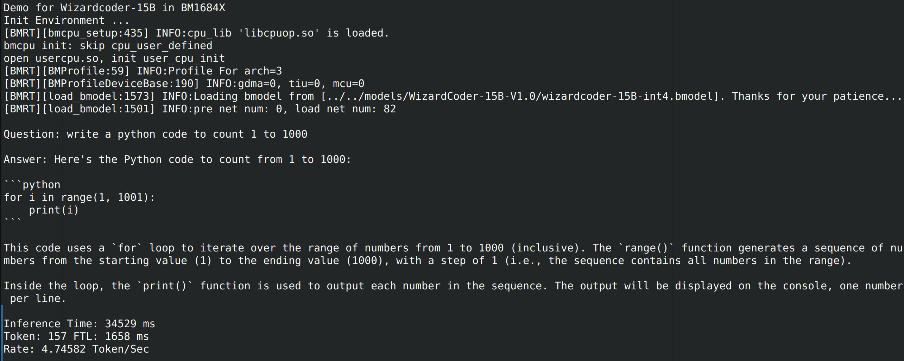

# Wizardcoder-TPU

本项目实现BM1684X部署语言大模型[Wizardcoder-15B](https://huggingface.co/WizardLM/WizardCoder-15B-V1.0)。通过[TPU-MLIR](https://github.com/sophgo/tpu-mlir)编译器将模型转换成bmodel，并采用c++代码将其部署到BM1684X的PCIE环境，或者SoC环境。

## 目录结构

```
.
├── assets
│   ├── sophgo_chip.png
│   └── wizardcoder.png
├── compile                                                ## 模型导出和转换所需脚本
│   ├── compile.sh
│   ├── export_to_onnx.py
│   └── modeling_gpt_bigcode.py
├── demo                                                   ## 模型运行代码
│   ├── CMakeLists.txt
│   ├── demo.cpp
│   ├── gpt2tokenizer.cc
│   ├── include
│   │   └── tokenizer.h
│   ├── lib_pcie                                            ## PCIE环境所需运行时
│   │   ├── include
│   │   │   ├── bmdef.h
│   │   │   ├── bmlib_runtime.h
│   │   │   └── bmruntime_interface.h
│   │   └── lib
│   │       ├── libbmlib.so
│   │       ├── libbmrt.so
│   │       └── libbmrt.so.1.0
│   └── lib_soc                                             ## SOC环境所需运行时
│       ├── include
│       │   ├── bmdef.h
│       │   ├── bmlib_runtime.h
│       │   └── bmruntime_interface.h
│       └── lib
│           ├── libbmlib.so
│           ├── libbmrt.so
│           └── libbmrt.so.1.0
├── Readme.md
└── vocab
    ├── merges.txt
    └── vocab.json


```

## Build


### Requirements

- 支持C++17标准的gcc或clang编译器
- 如果不使用```demo/libsophon_pcie```的libsophon或者需要特定版本的libsophon，需要在下面编译时指定```LIBSOPHON_DIR```
- 转换好的Wizardcoder-15B.bmodel文件，需要和本仓库中```vocab```目录下的两个文件放在一起。模型转换过程可以参考下文

## 开发环境准备

### 1. 下载模型(以`Wizardcoder-15B-V1.0`为例)

``` shell
git lfs install
git clone https://huggingface.co/WizardLM/WizardCoder-15B-V1.0
```

该工程比较大，会花较长时间。


### 2. 下载本项目`Wizardcoder-TPU`

下载本项目，并导出所有的ONNX（其中需要将本项目`compile`路径下的`modeling_gpt_bigcode.py`文件替换到`transformers`的文件夹下，具体步骤如下：

#### clone本工程
``` shell
git clone https://github.com/enigma9981/Wizardcoder-TPU
cd Wizardcoder-TPU
```

#### 修改模型文件
- 使用```pip show transformers```找到```transformers```的位置
- 使用提供的```compile/modeling_gpt_bigcode.py```替换```python3.11/site-packages/transformers/models/gpt_bigcode/```下的同名文件


#### 导出ONNX格式模型
```shell
python export_to_onnx.py --model_path your_model_path
```
- your_model_path 指的是原模型下载后的地址, 如:"../../WizardCoder-15B-V1.0/"
- 如果你想要debug，而不是一下子生成完成全部的onnx模型，可以将36行的num_layers改成1, 结合144行的函数对比单个block情况下是否可以和pytroch版本对齐
- 脚本运行完毕后会在```./tmp/```下生成大量ONNX模型，用于后续在TPU上进行转换

### 3. 下载docker，启动容器

``` shell
docker pull sophgo/tpuc_dev:latest

# myname1234 is just an example, you can set your own name
docker run --privileged --name myname1234 -v $PWD:/workspace -it sophgo/tpuc_dev:latest
```
后文假定环境都在docker的`/workspace`目录。

### 4. 下载`TPU-MLIR`代码并编译

(也可以直接下载编译好的release包解压)

``` shell
git clone git@github.com:sophgo/tpu-mlir.git
cd tpu-mlir
source ./envsetup.sh
./build.sh
```

## 编译模型

注意此时在Docker环境workspace目录。

### 注册所需的环境变量
```shell
source dir_to_tpu_mlir/envsetup.sh
```
### 开始模型转换

在`Wizardcoder-TPU/compile`目录下，执行：
```shell
./compile.sh --mode int4
```
稍等片刻即可导出int4量化后的bmodel文件


- 受TPU内存的限制```./compile.sh```目前仅支持在单芯上进行INT4量化，执行```./compile.sh --mode int4```后会在目录下生成```wizardcoder-15B_int4.bmodel```文件
- 后续会支持多芯上的推理，请使用```./compile.sh --mode [F16/int8/int4] --num_device [2/4/8]```进行转换，编译完成后最终会在compile路径下生成名为wizardcoder-15B_{X}_{Y}dev.bmodel的模型文件，其中X代表量化方式，其值有F16/int8/int4等，Y代表使用的芯片个数，其值可能有1/2/4/8等。
- 生成bmodel耗时大概3小时以上，建议64G内存以及300G以上磁盘空间，不然很可能OOM或者no space left

## 编译程序(C++)

### PCIE 版本
执行如下编译 (注意如果是SoC版本，需要把demo目录拷贝到SoC环境编译)：

```shell
cd Wizardcoder-TPU/demo
mkdir build
cd build
cmake ..
make
```

### SOC版本（在SOC设备上编译）
```shell
cd Wizardcoder-TPU/demo
mkdir build
cd build
cmake .. -DTARGET_ARCH=soc
make
```

编译生成`wizardcoder`可执行程序，将本工程目录下的`vocab/merges.txt`、`vocab/vocab.json`和生成的`wizardcoder-15B_int4.bmodel`拷贝到同一个目录下就可以执行了。

完成上文的编译过程后，生成```demo/build/wizardcoder```可执行文件，它可以完成加载bmodel并在```BM1684X```设备上进行推理。示例：

```shell
demo/build/wizardcoder -m /path/to/bmodel -d 0
```

- -m 指定bmodel的位置，在bmodel的同级目录下，需要有```vocab```目录的两个```vocab.json```和```merges.txt```，作为tokenzier需要的文件
- -d 指定推理使用的芯片，默认id是0，如果需要在多芯片上推理，请使用逗号分割，如：-d 0,1,2,3

## 运行效果

以下为单芯片下INT4量化模式的运行效果：



## 常见问题

### demo程序无法正常运行

如果demo程序拷贝到运行环境提示无法运行，比如接口找不到等等错误。
原因是运行环境的库有所不同，将demo中的`lib_pcie`（PCIE）或者 `lib_soc`(SoC)里面的so文件拷贝到运行环境，链接到里面的so即可。


### Wizardcoder-TPU做了哪些修改

只对`modeling_gpt_bigcode.py`做了部分调整。


#### 1. 对`modeling_gpt_bigcode.py`文件代码做调整

1) 修改如下（这是因为TORCH2的算子转ONNX会失败）：

    ``` python
    sdpa_result = _scaled_dot_product_attention(
            query,
            key,
            value,
            attn_mask=attention_mask,
            dropout_p=self.attn_pdrop if self.training else 0.0,
            # The query_length > 1 is necessary to match with AttentionMaskConverter.to_causal_4d that does not create a causal mask in case query_length == 1.
            is_causal=self.is_causal and attention_mask is None and query_length > 1,
            scale=scale,
        )
    ```
    大概在560行左右，将`F.scaled_dot_product_attention`替换成了自己的实现:
    ```python
    def _scaled_dot_product_attention(query, key, value, attn_mask=None, dropout_p=0.0, is_causal=False, scale=None) -> torch.Tensor:
        L, S = query.size(-2), key.size(-2)
        scale_factor = 1 / math.sqrt(query.size(-1)) if scale is None else scale
        attn_bias = torch.zeros(L, S, dtype=query.dtype)
        if is_causal:
            assert attn_mask is None
            temp_mask = torch.ones(L, S, dtype=torch.bool).tril(diagonal=0)
            attn_bias.masked_fill_(temp_mask.logical_not(), float("-inf"))
            attn_bias.to(query.dtype)

        if attn_mask is not None:
            attn_bias = attn_mask
        
        attn_weight = query @ key.transpose(-2, -1) * scale_factor
        attn_weight += attn_bias
        attn_weight = torch.softmax(attn_weight, dim=-1)
        return attn_weight @ value
    
    ```
2) 修改如下
    ```python
    # self.attn = GPTBIGCODE_ATTENTION_CLASSES[config._attn_implementation](config, layer_idx=layer_idx)
    self.attn = GPTBigCodeSdpaAttention(config, layer_idx=layer_idx)
    ```
    大概在673左右，强制使用GPTBigCodeSdpaAttention，便于计算
